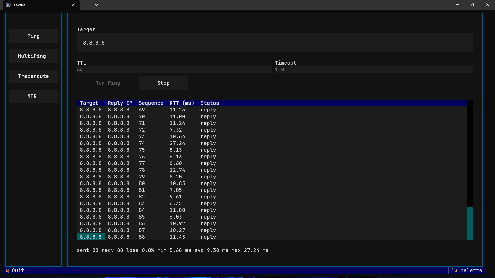
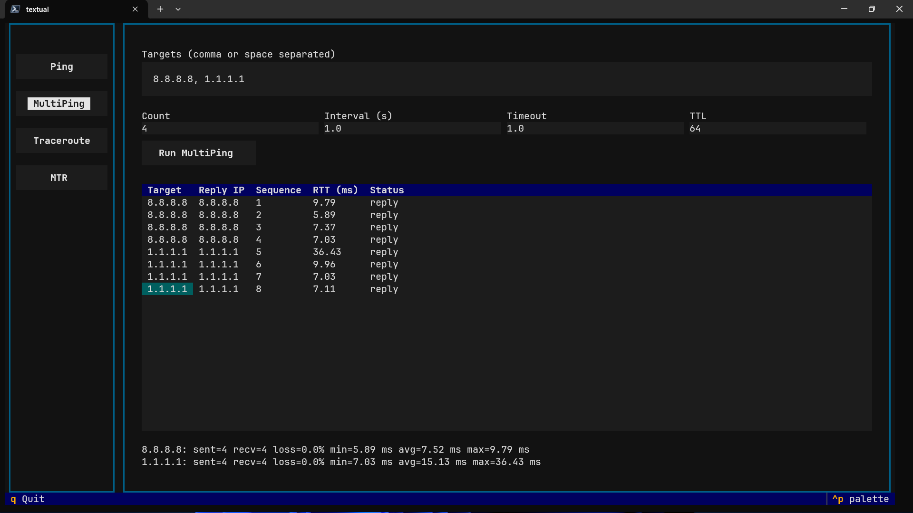
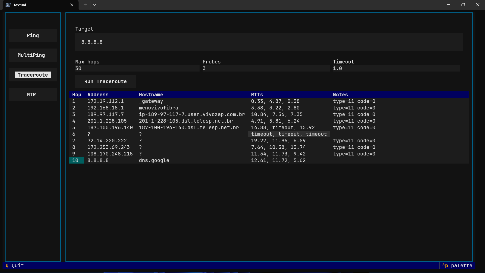
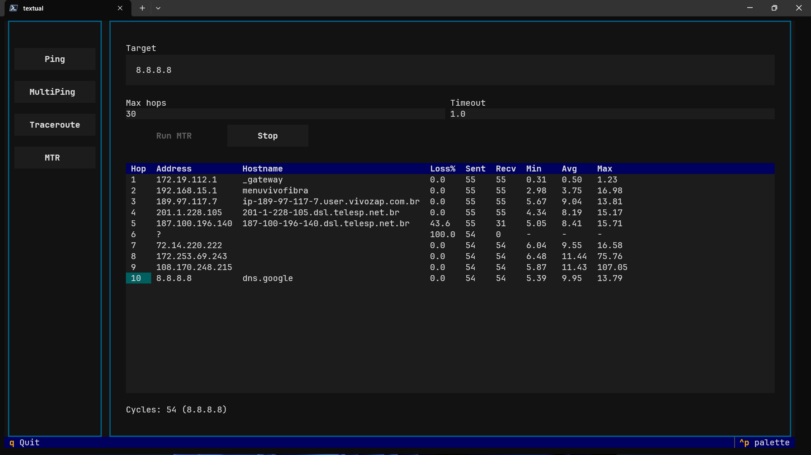

# icmpx

Uma biblioteca Python para criar diagnósticos ICMP com sockets *raw*. A API atual privilegia blocos reutilizáveis em vez de empacotar ferramentas do sistema, permitindo compor pings, *probes* e rotas diretamente em Python.

## Recursos

- `Client` com *context manager* para abrir e fechar o socket ICMP com segurança
- `probe()` para medir um hop específico, `ping()` para séries de amostras e `traceroute()` para descobrir rotas
- Dataclasses ricas (`EchoResult`, `TracerouteResult`, `ReceivedPacket` e outras) prontas para pós-processamento
- *Reverse DNS* opcional por requisição
- Exceção `RawSocketPermissionError` com instruções de privilégio quando o socket não pode ser criado

## Pré-requisitos

- Python 3.14 ou superior (veja `pyproject.toml`)
- Ambiente Linux com permissão para abrir sockets ICMP *raw*

Conceda a permissão ao interpretador uma única vez:

```bash
sudo setcap cap_net_raw+ep "$(realpath $(which python))"
```

## Início rápido

Clone o repositório e configure o ambiente com `uv`:

```bash
git clone https://github.com/oornnery/icmpx.git
cd icmpx
uv venv
uv sync
uv pip install .
sudo setcap cap_net_raw+ep "$(realpath $(which python))"
```

Depois de conceder `CAP_NET_RAW`, execute qualquer script de exemplo:

```bash
uv run examples/ping.py
```

Ou explore o traceroute:

```bash
uv run examples/traceroute.py
```

## Exemplos de uso

### Loop de ping básico

```python
from icmpx import Client

with Client(timeout=1.5) as client:
    resultados = client.ping("8.8.8.8", count=3)
    for resultado in resultados:
        if resultado.error:
            print(f"{resultado.request.addr}: {resultado.error}")
        else:
            print(
                f"resposta de {resultado.reply.received_packet.ip_header.src_addr} "
                f"em {resultado.reply.rtt:.2f} ms"
            )
```

Cada `EchoResult` carrega a requisição original, um `EchoReply` com o RTT medido e eventuais erros ICMP recebidos.

### Fluxo de traceroute

```python
from icmpx import Client

with Client(resolve_dns_default=True) as client:
    trace = client.traceroute("1.1.1.1", probes=2)
    for hop in trace.hops:
        addr = hop.addr or "?"
        host = hop.hostname or "?"
        rtts = [
            f"{probe.rtt:.2f} ms" if probe.rtt != float("inf") else "timeout"
            for probe in hop.probes
        ]
        print(f"{hop.ttl:>2}: {addr:<16} {host:<32} {' '.join(rtts)}")
```

`Client.traceroute()` retorna um `TracerouteResult` com metadados por hop, incluindo *reverse DNS* opcional e todos os RTTs coletados.

### Loop MTR em tempo real

```bash
uv run examples/mtr.py 1.1.1.1 -c 10 -i 0.5
```

O script atualiza uma tabela Rich com perda de pacotes e métricas de RTT por hop a cada ciclo configurado.

```bash
(icmpx) ➜  icmpx git:(main) ✗ uv run examples/mtr.py 8.8.8.8 -c 100
Found existing alias for "uv run". You should use: "uvr"
                                                                                       MTR to 8.8.8.8
┌─────────┬─────────────────────────────┬──────────────────────────────────────────────────────────────┬──────────┬──────────┬──────────────┬────────────┬───────────┬──────────┬──────────┐
│     Hop │ Address                     │ Hostname                                                     │     Sent │     Recv │       Loss % │       Last │       Avg │     Best │    Worst │
├─────────┼─────────────────────────────┼──────────────────────────────────────────────────────────────┼──────────┼──────────┼──────────────┼────────────┼───────────┼──────────┼──────────┤
│       1 │ 172.19.112.1                │ _gateway                                                     │      100 │      100 │          0.0 │       0.69 │      0.53 │     0.30 │     5.53 │
│       2 │ 192.168.15.1                │ menuvivofibra                                                │      100 │      100 │          0.0 │       3.52 │      5.46 │     3.07 │    37.70 │
│       3 │ 189.97.117.7                │ ip-189-97-117-7.user.vivozap.com.br                          │      100 │      100 │          0.0 │       7.77 │      9.46 │     5.46 │    30.08 │
│       4 │ 201.1.228.105               │ 201-1-228-105.dsl.telesp.net.br                              │      100 │      100 │          0.0 │       9.13 │      9.58 │     4.53 │    28.16 │
│       5 │ 187.100.196.140             │ 187-100-196-140.dsl.telesp.net.br                            │      100 │       72 │         28.0 │      13.78 │     11.10 │     4.97 │    41.67 │
│       6 │ ?                           │                                                              │      100 │        0 │        100.0 │          - │         - │        - │        - │
│       7 │ 72.14.220.222               │                                                              │      100 │      100 │          0.0 │       7.78 │     11.94 │     5.76 │    46.18 │
│       8 │ 172.253.69.243              │                                                              │      100 │      100 │          0.0 │      10.51 │     11.85 │     7.07 │    29.55 │
│       9 │ 108.170.248.215             │                                                              │      100 │      100 │          0.0 │      12.49 │     10.69 │     5.80 │    30.14 │
│      10 │ 8.8.8.8                     │ dns.google                                                   │      100 │      100 │          0.0 │       9.79 │     10.79 │     5.82 │    42.93 │
└─────────┴─────────────────────────────┴──────────────────────────────────────────────────────────────┴──────────┴──────────┴──────────────┴────────────┴───────────┴──────────┴──────────┘
```

### TUI interativa

Inicie a interface Textual para acessar múltiplos diagnósticos no mesmo lugar:

```bash
uv run icmpx
```

Use `q` (ou os controles do terminal) para encerrar quando quiser. Todas as visões dependem de sockets ICMP *raw*, então garanta o `CAP_NET_RAW` antes de abrir a TUI.

A interface oferece visões específicas para:

- `Ping`: execução contínua com botão `Stop`, resumo ao vivo de RTT/perda e configuração de TTL/timeout.
- `MultiPing`: lotes de destinos com estatísticas agregadas sempre visíveis abaixo da tabela de respostas.
- `Traceroute`: descoberta de hops com *reverse DNS* opcional e RTT detalhado por *probe* após a execução.
- `MTR`: ciclos sucessivos que atualizam as métricas de cada hop até ser interrompido, similar ao `mtr` tradicional.

Dicas:

- Navegue entre as visões pelos botões da barra lateral sem reiniciar a sessão.
- Mensagens de validação e erros de permissão aparecem como notificações na parte inferior da tela.
- Ajuste o timeout para valores maiores se notar perda acentuada de pacotes durante os testes.

#### Pré-visualização da TUI









## Scripts de exemplo

- `examples/ping.py` — caminho mais curto para enviar múltiplos echos ICMP
- `examples/traceroute.py` — descoberta hop a hop usando a API da biblioteca
- `icmpx/demo.py` — TUI em Textual com visões de Ping, MultiPing, Traceroute e MTR (execute com `uv run icmpx`)
- `examples/mtr.py` — tabela dinâmica com Rich que imita o fluxo do `mtr`

Copie esses scripts como ponto de partida ou integre o `Client` diretamente em serviços existentes.

## Tratamento de erros

Se o interpretador não conseguir criar o socket *raw*, o `Client` lança `RawSocketPermissionError` com orientações sobre `CAP_NET_RAW`. Os timeouts aparecem como `EchoResult.error == "timeout"`, enquanto respostas ICMP preservam seus códigos para diagnóstico detalhado.

## Próximos passos

- Suporte a IPv6
- Multiping com agregação para múltiplos destinos
- Cliente compatível com `asyncio`
- Novos exemplos e documentação narrativa

Contribuições são bem-vindas — abra uma issue com sua necessidade ou ideia.
